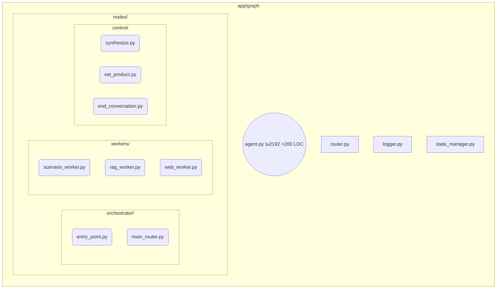

# LangGraph 에이전트 리팩터링 Phase 1 – TRD

## 1. Architecture Overview


- **nodes/**: 각 LangGraph 노드를 독립 모듈로 이관 (orchestrator, workers, control로 분류)
- **router.py**: `execute_plan_router` + mapping 상수화
- **logger.py**: `LogManager`를 thin-wrapper로 노드 공통 util 제공
- **state_manager.py**: 시나리오 연속성 관리 로직 중앙화

## 2. Detailed Design
### 2.1 모듈 분리 전략
1. `agent.py`에서 class/function 단위로 추출
2. 노드 함수의 시그니처 유지 (`async def node(state: AgentState) -> AgentState`)
3. `workflow_build()` 함수에서 모듈 import 후 graph 구성

### 2.2 로깅 개선
- `logger.py`
```python
from deepbrain_llm_log import LogManager
log = LogManager.get_logger(__name__)

def node_log(node: str, *, input: str = "", output: str = ""):
    if input and output:
        log.info("🔄 [%s] %s → %s", node, input, output)
    elif input:
        log.info("🔄 [%s] %s", node, input)
    else:
        log.info("🔄 [%s]", node)
```
- 노드 함수 내 `print` → `node_log()` 치환
- `LogManager`가 PII 마스킹 수행 (기존 구현 재사용)

### 2.3 정적 상태 모델
```python
# app/graph/state.py
class SessionState(BaseModel, extra="forbid"):
    session_id: str
    current_product_type: str | None = None
    collected_product_info: dict[str, Any] = Field(default_factory=dict)
    messages: list[BaseMessage] = Field(default_factory=list)
    scenario_ready_for_continuation: bool = False
    scenario_awaiting_user_response: bool = False

class TurnState(BaseModel, extra="forbid"):
    user_input_text: str | None = None
    action_plan: list[str] = Field(default_factory=list)
    action_plan_struct: list[dict] = Field(default_factory=list)
    scenario_agent_output: dict | None = None
    error_message: str | None = None
    final_response_text_for_tts: str | None = None
    is_final_turn_response: bool = False

class AgentState(SessionState, TurnState):
    """통합 상태 모델 - LangGraph 노드에서 사용"""
    pass
```
- 세션 지속 상태와 턴별 상태를 명확히 분리
- 노드별로 필요한 상태 필드만 액세스

### 2.4 문서화
- `README.md`에 다이어그램 삽입 및 각 노드/상태 설명 테이블 추가

## 3. Test Plan
| 영역 | 테스트 | 도구 |
| ---- | ------ | ---- |
| 노드 분리 | import/graph compile | `pytest` + `LangGraph` dry run |
| 로깅 | print 존재 여부 | `flake8-print` CI 체크 |
| AgentState | extra field 거부 | 유닛 테스트로 예외 확인 |
| E2E | 이전 테스트 스위트 재실행 | `pytest-asyncio` |

## 4. Migration Steps
1. **로거 인프라 구축** – logger.py 생성 및 비동기 래퍼 구현 (Day 2)
2. **디렉토리 구조 생성** – nodes/ 하위 디렉토리 및 __init__.py 파일 (Day 2)
3. **노드 분리** – 카테고리별로 노드 이동, agent.py에 re-export 유지 (Day 3)
   - scenario_worker.py에 call_scenario_agent_node + process_scenario_logic_node 통합
4. **상태 모델 전환** – SessionState/TurnState 분리, state_manager.py 생성 (Day 4)
5. **동적 import 정리** – entity_agent, chat_utils 정적 import로 변경 (Day 4)
6. **통합 테스트** – 기존 테스트 실행 및 import 경로 수정 (Day 5)
7. **문서 업데이트** – README, 다이어그램, 각 노드 입출력 명세 (Day 5)

## 5. Rollback Plan
- `ENABLE_NEW_GRAPH=false` 환경 변수 → 기존 `agent.py` 경로 유지
- 에러 발생 시 CI 파이프라인에서 자동 실패 & 롤백 스크립트 실행

## 6. Open Questions
- 파일 분리 후 상대 import 경로 표준 (absolute vs relative)
- scenario_worker.py 통합 시 함수명 충돌 해결 방안

---
**Revision History**
| 버전 | 날짜 | 설명 |
| ---- | ---- | ---- |
| v0.1 | today | 최초 작성 |