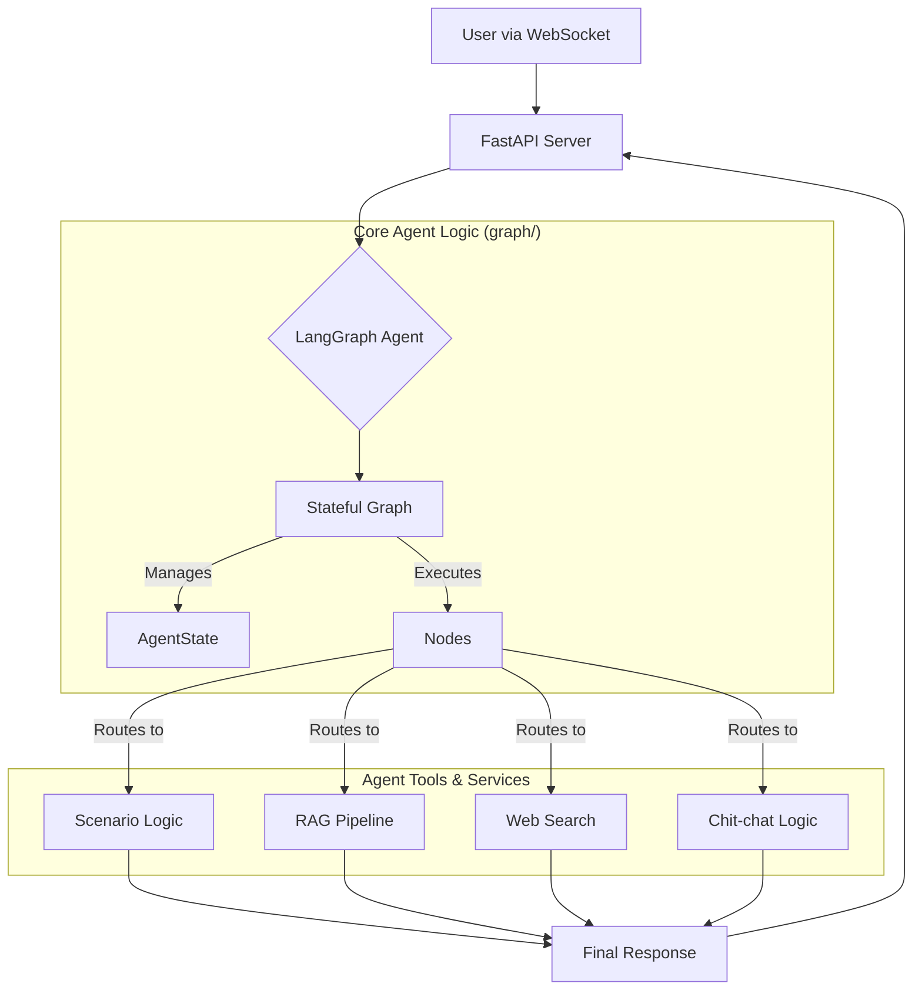

# 백엔드 (Python FastAPI & LangGraph)

## 개발 환경 설정

1.  **Python 3.12 설치**
2.  **가상 환경 생성 및 활성화**:
    ```bash
    python3 -m venv venv
    source venv/bin/activate  # Linux/macOS
    # 또는
    # .\venv\Scripts\activate  # Windows
    ```
3.  **의존성 설치**:
    ```bash
    pip install -r requirements.txt
    ```
4.  **.env 파일 설정**:
    - `.env.example` 파일을 복사하여 `.env` 파일을 생성합니다.
    - `OPENAI_API_KEY`에 OpenAI API 키를 입력합니다.
    - `GOOGLE_APPLICATION_CREDENTIALS`에 Google Cloud 서비스 계정 키 JSON 파일의 절대 경로를 입력합니다.
      ([Google Cloud 서비스 계정 키 생성 가이드](https://cloud.google.com/iam/docs/creating-managing-service-account-keys))

## 실행

Uvicorn을 사용하여 FastAPI 애플리케이션을 실행합니다.

```bash
uvicorn app.main:app --reload --port 8000
```

(--reload는 개발 시 유용하며, 파일 변경 시 서버를 자동으로 재시작합니다.)

## 주요 라이브러리

- FastAPI (웹 프레임워크)
- Uvicorn (ASGI 서버)
- Langchain & LangGraph (LLM 애플리케이션 프레임워크)
- OpenAI Python Client
- Google Cloud Python Client (Speech-to-Text, Text-to-Speech)
- Pydantic (데이터 유효성 검사)
- python-dotenv (환경 변수 관리)
- websockets (FastAPI WebSocket 지원)

<!-- end list -->

## 🤖 아키텍처 개요

이 시스템은 FastAPI 기반의 WebSocket 서버 위에서 LangGraph를 사용하여 구축된 **상태 기반(Stateful) AI 에이전트**입니다. 사용자의 발화에 따라 동적으로 행동을 결정하며, 정해진 시나리오를 수행하거나 지식 베이스(RAG) 또는 웹 검색을 통해 질문에 답변하는 등 복합적인 작업을 처리할 수 있습니다.

### 핵심 아키텍처 다이어그램



### 주요 컴포넌트 설명

1.  **FastAPI Application (`app/main.py`, `app/api/`)**
    -   **역할**: 웹 서버의 엔트리포인트 및 클라이언트와의 통신 채널.
    -   **주요 기능**:
        -   WebSocket (`/api/v1/chat/ws/{session_id}`)을 통해 실시간 양방향 통신을 처리합니다.
        -   서버 시작 시 `lifespan` 이벤트를 통해 RAG, 웹 검색 등 주요 서비스를 미리 초기화하여 지연 시간을 줄입니다.

2.  **LangGraph Agent (`app/graph/`)**
    -   **역할**: 시스템의 **두뇌**. 사용자의 발화와 현재 대화 상태를 바탕으로 다음에 할 일을 결정하고 실행합니다.
    -   **`agent.py`**: 그래프의 모든 노드(Node)와 엣지(Edge)가 정의된 핵심 파일입니다.
        -   `main_agent_router_node`: **시나리오 중심의 계층적 라우터**입니다. "진행 중인 시나리오가 있는가?"를 최우선으로 판단하고, 사용자의 의도에 따라 시나리오 진행, RAG 질의응답, 웹 검색, 잡담 처리 등 가장 적절한 노드로 작업을 분기합니다.
        -   `factual_answer_node`: 내부 지식(RAG)이 필요한 질문을 처리합니다.
        -   `web_search_node`: 외부 지식(웹 검색)이 필요한 질문을 처리합니다.
        -   `call_scenario_agent_node` & `process_scenario_logic_node`: 정해진 금융 상담 시나리오를 단계별로 진행합니다.
    -   **`state.py`**: 대화의 전체 맥락(메시지 기록, 현재 상품, 시나리오 단계, 수집된 정보 등)을 담고 있는 `AgentState` 데이터 클래스를 정의합니다. 이 상태 객체는 그래프의 노드를 거치면서 계속 업데이트됩니다.

3.  **핵심 서비스 (`app/services/`)**
    -   **역할**: 특정 기능을 수행하는 독립적인 모듈.
    -   `rag_service.py`: 내부 문서(`app/data/`)에 대한 질의응답을 담당합니다.
        -   **Vector DB**: LanceDB를 사용하여 문서 임베딩을 저장하고 검색합니다.
        -   **Hybrid Search**: 의미 기반의 벡터 검색과 키워드 기반의 BM25 검색을 결합하여 검색 정확도를 높입니다.
        -   **Query Expansion**: 사용자의 질문을 대화 맥락에 맞게 여러 개의 상세한 질문으로 확장하여 더 풍부한 검색 결과를 얻습니다.
    -   `web_search_service.py`: 도메인을 벗어난 질문(예: 주식, 뉴스, 일반 상식)에 답변하기 위해 **Tavily API**를 사용한 웹 검색을 수행합니다.

4.  **프롬프트 및 지식 베이스 (`app/config/`, `app/data/`)**
    -   `config/`: 에이전트의 성격, 판단 기준, 라우팅 로직 등 모든 LLM의 행동 지침이 담긴 프롬프트가 YAML 파일로 관리됩니다. 이를 통해 코드 변경 없이 에이전트의 행동을 유연하게 수정할 수 있습니다.
    -   `data/`: RAG가 사용하는 금융 상품 관련 내부 지식 베이스가 마크다운(`.md`) 파일 형태로 저장됩니다.

## 🧪 테스팅

### 테스트 실행

```bash
# 테스트 의존성 설치
pip install -r requirements-test.txt

# 단위 테스트 실행
python test_runner.py unit

# 통합 테스트 실행 (루트 디렉토리에서)
cd ..
python test_runner.py integration

# 모든 테스트 실행
python test_runner.py all

# 커버리지 리포트 포함
python test_runner.py coverage
```

### 테스트 구조

- **`tests/`** - 백엔드 단위 테스트
  - `test_agent_routing.py` - LangGraph 에이전트 라우팅 테스트
  - `test_rag_pipeline.py` - RAG 파이프라인 테스트
  - `test_services.py` - 서비스 레이어 테스트
  - `test_qa_scenarios.py` - QA 시나리오 테스트

- **`conftest.py`** - 테스트 픽스처 및 모킹 설정
- **`pytest.ini`** - 테스트 설정 및 커버리지 구성

### 테스트 커버리지

- **목표**: 80% 이상의 코드 커버리지
- **포함 범위**: 에이전트 로직, RAG 파이프라인, 서비스 통합
- **제외**: 외부 API 호출, 환경 설정

자세한 테스트 가이드는 [README_TESTING.md](../README_TESTING.md)를 참조하세요.
