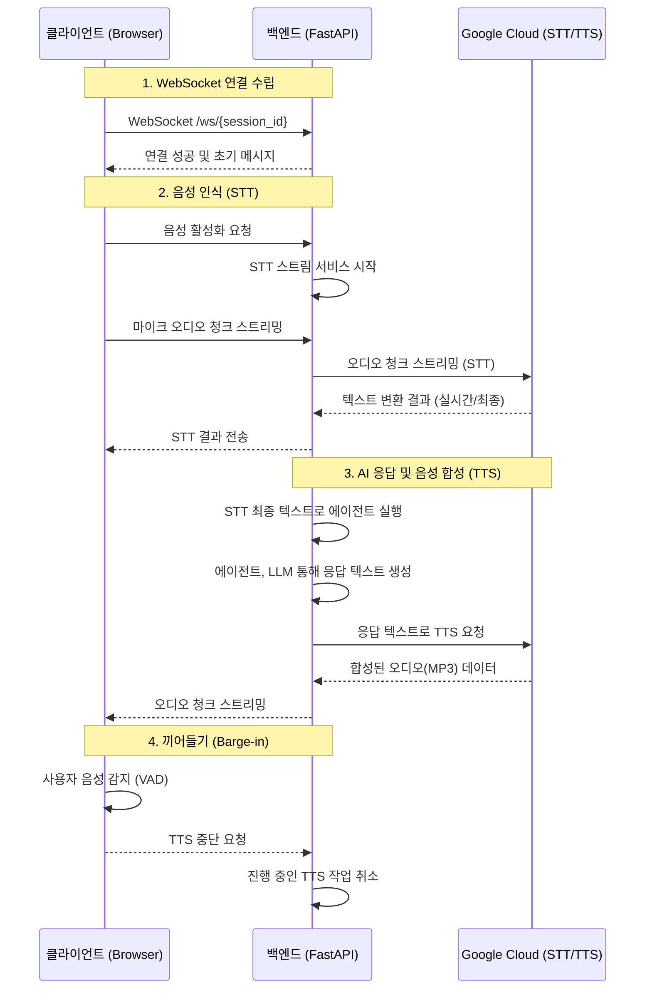

# 음성 입출력(STT/TTS) 동작 방식 개요

이 문서는 디딤돌 음성 에이전트 프로젝트의 핵심 기능인 STT(Speech-to-Text), TTS(Text-to-Speech), 그리고 Barge-in(끼어들기) 기능의 전체적인 데이터 흐름과 기술적 구현 방식을 설명합니다.

## 전체 아키텍처

음성 처리는 **클라이언트(웹 브라우저)**, **백엔드(FastAPI 서버)**, 그리고 **Google Cloud 서비스** 세 부분의 긴밀한 상호작용을 통해 이루어집니다. 모든 실시간 통신은 **WebSocket**을 기반으로 합니다.

---

## 1. 음성 녹음 및 서버 전송 (STT)

사용자가 마이크 버튼을 누르면 음성 인식 과정이 시작됩니다.

1.  **마이크 활성화 (클라이언트, `chatStore.ts`)**:
    *   `activateVoiceRecognition` 함수가 호출되어 음성 모드를 활성화하고, 서버에 `activate_voice` 메시지를 보냅니다.
    *   `startRecording` 함수가 사용자로부터 마이크 사용 권한을 얻어 오디오 스트림(`MediaStream`)을 생성합니다.

2.  **오디오 처리 파이프라인 구축 (클라이언트, `chatStore.ts`)**:
    *   **단일 `AudioContext` 생성**: VAD(음성 감지)와 서버 전송용 오디오 처리를 위해 하나의 통합된 `AudioContext`를 생성하여 리소스 충돌을 방지합니다.
    *   **오디오 그래프 구성**:
        *   마이크 스트림은 `MediaStreamAudioSourceNode`를 통해 오디오 컨텍스트로 들어옵니다.
        *   이 소스는 **두 갈래**로 나뉩니다.
            1.  **VAD**: `AnalyserNode`로 연결되어 실시간으로 사용자의 음성 활동을 감지합니다. (Barge-in 기능의 핵심)
            2.  **서버 전송**: `AudioWorkletNode`로 연결됩니다. `audio-processor.js` 워크릿은 원본 오디오를 서버(Google STT)가 요구하는 형식(16-bit, 16kHz, Mono)으로 변환(Down-sampling)합니다.

3.  **오디오 스트리밍 (클라이언트 → 서버)**:
    *   `AudioWorklet`에서 처리된 오디오 데이터 청크( `ArrayBuffer` 형태)는 WebSocket을 통해 실시간으로 백엔드 서버에 전송됩니다.

4.  **서버 STT 처리 (백엔드, `google_services.py`)**:
    *   서버는 클라이언트로부터 `activate_voice` 메시지를 받으면 해당 세션의 `StreamSTTService`를 활성화하고 Google STT API와의 스트리밍 연결을 준비합니다.
    *   오디오 청크가 도착하면, `process_audio_chunk` 함수를 통해 Google STT API로 전달됩니다.
    *   Google은 오디오를 수신하는 대로 실시간 변환 결과(`interim_result`)와 최종 변환 결과(`final_result`)를 서버로 보내줍니다.

5.  **결과 반환 (서버 → 클라이언트)**:
    *   서버는 Google로부터 받은 STT 결과를 즉시 클라이언트에 `stt_interim_result`, `stt_final_result` 타입의 WebSocket 메시지로 전달하여 화면에 표시합니다.

---

## 2. AI 응답 및 음성 재생 (TTS)

서버가 STT 최종 결과를 받으면, AI가 응답을 생성하고 이를 다시 음성으로 변환하여 클라이언트에 전달합니다.

1.  **에이전트 실행 (백엔드, `chat.py`)**:
    *   `handle_stt_final_result_with_tts_wrapper` 함수는 STT 최종 텍스트를 입력값으로 `process_input_through_agent` 함수를 호출합니다.
    *   에이전트는 내부 로직(LLM 호출 등)을 통해 사용자 질의에 대한 답변 텍스트를 생성합니다.

2.  **문장 단위 분리 및 TTS 요청 (백엔드, `chat.py`)**:
    *   에이전트가 생성한 전체 응답 텍스트는 `split_into_sentences` 함수를 통해 자연스러운 문장 단위로 분리됩니다.
    *   백엔드는 **한 문장씩** 루프를 돌며 `StreamTTSService`의 `start_tts_stream` 함수를 호출하여 Google TTS API에 음성 합성을 요청합니다. 이는 긴 문장을 한 번에 요청하는 것보다 첫 응답까지의 지연 시간을 줄여주는 효과가 있습니다.

3.  **오디오 스트리밍 (서버 → 클라이언트)**:
    *   Google TTS로부터 합성된 오디오(MP3)를 받은 `StreamTTSService`는 이를 `simulated_chunk_size_bytes` (예: 32KB) 단위로 잘라 Base64로 인코딩합니다.
    *   인코딩된 오디오 청크는 `tts_audio_chunk` 타입의 WebSocket 메시지로 클라이언트에 전송됩니다.
    *   한 문장의 오디오 전송이 모두 끝나면, `tts_stream_end` 메시지를 보내 문장의 끝을 알립니다.

4.  **오디오 큐 및 재생 (클라이언트, `chatStore.ts`)**:
    *   클라이언트는 `tts_audio_chunk`를 수신할 때마다 `_incomingTTSChunksForSentence` 버퍼에 저장합니다.
    *   `tts_stream_end` 메시지를 받으면, 버퍼에 모인 청크들을 하나의 오디오 세그먼트로 묶어 `ttsAudioSegmentQueue`에 추가합니다.
    *   `playNextQueuedAudioSegment` 함수가 자동으로 트리거되어 큐에서 첫 번째 오디오 세그먼트를 꺼내 재생합니다.
        *   Base64 청크들을 디코딩하여 `Blob` 객체를 만들고, `URL.createObjectURL`을 통해 오디오 플레이어가 재생할 수 있는 주소를 생성합니다.
        *   하나의 오디오 세그먼트(문장) 재생이 끝나면, 자동으로 `playNextQueuedAudioSegment`를 다시 호출하여 큐에 남아있는 다음 문장을 재생합니다.

---

## 3. 끼어들기 (Barge-in)

Barge-in은 AI가 말하는(TTS) 도중에 사용자가 말을 시작하면 AI의 말을 끊고 사용자의 말을 인식하는 기능입니다. 이 기능은 전적으로 클라이언트에서 처리됩니다.

1.  **음성 활동 감지 (클라이언트, `chatStore.ts`)**:
    *   AI의 TTS가 재생 중(`isPlayingTTS == true`)이고, 음성 모드가 활성화된(`isVoiceModeActive == true`) 상태에서 `startClientSideVAD` 함수가 주기적으로 마이크 입력을 모니터링합니다.
    *   위에서 설명한 `AnalyserNode`를 통해 측정된 마이크 입력 에너지 레벨이 설정된 임계값(`VAD_THRESHOLD`)을 넘어서면 사용자가 말을 시작한 것으로 간주합니다.

2.  **TTS 중단 처리 (클라이언트, `chatStore.ts`)**:
    *   Barge-in이 감지되면 `stopClientSideTTSPlayback(true)` 함수가 즉시 호출됩니다.
    *   이 함수는 다음 세 가지 중요한 작업을 수행합니다.
        1.  **로컬 재생 중지**: 현재 재생 중인 `HTMLAudioElement`를 즉시 일시정지(`pause()`)시킵니다.
        2.  **큐 비우기**: `ttsAudioSegmentQueue`에 남아있던 다음 문장들의 오디오 세그먼트를 모두 비워, 현재 문장이 멈춘 후 다음 문장이 재생되지 않도록 합니다.
        3.  **서버에 알림**: `stop_tts` 타입의 WebSocket 메시지를 서버로 전송합니다.

3.  **서버 TTS 작업 취소 (백엔드, `chat.py` & `google_services.py`)**:
    *   서버는 `stop_tts` 메시지를 받으면, `StreamTTSService`의 `stop_tts_stream` 함수를 호출합니다.
    *   이 함수는 현재 진행 중이던 Google TTS API와의 비동기 작업을 취소(`cancel()`)합니다.
    *   또한, 문장 단위로 TTS를 요청하던 `process_input_through_agent`의 루프도 `tts_cancelled` 플래그를 통해 중단됩니다.
    *   이로써 불필요한 TTS 요청과 오디오 데이터 전송을 막아 리소스를 절약합니다.

이후의 과정은 다시 일반적인 STT 과정으로 이어집니다. 사용자의 끼어든 발화가 서버로 스트리밍되고, 텍스트로 변환되어 새로운 AI 응답을 생성하게 됩니다. 